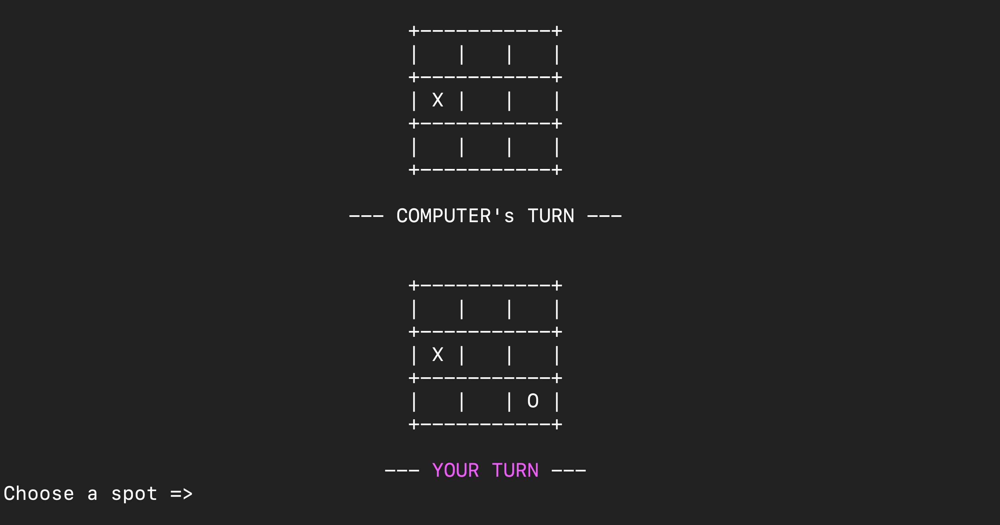
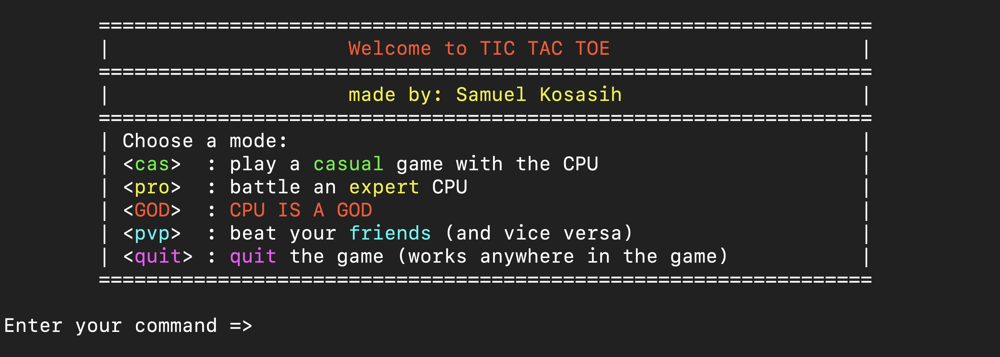

# TicTacToe
 
## Getting Started

### Prerequisites
* **ruby**: 
  This program was written in `ruby 3.1.2p20`. Your computer may already have *Ruby* installed. You can check by:
  ```
  ruby -v
  ```
  Otherwise, you can head over to their installation documentation over <a href="https://www.ruby-lang.org/en/documentation/installation/"     target="_blank">here (ruby-lang.org)</a>.

* **colorize**: 
  To display colorful text, install the `colorize (0.8.1)` gem:
  ```
  gem install colorize
  ```
  Unix systems may require `sudo`. <a href="https://github.com/fazibear/colorize" target="_blank">Link to repo (github.com/fazibear)</a>.
  
<br>

### Running the Game Locally

To get the game running locally on your terminal, clone the repo to your desired directory:
```
git clone https://github.com/SamAdrn/TicTacToe.git
```
Then, enter the the `TicTacToe` directory:
```
cd TicTacToe
```
And finally, run the [`runner.rb`](runner.rb) file through the `ruby` command:
```
ruby runner.rb
```

<br>

## Playing the Game

## Welcome to TicTacToe



As you start the game, you are given four different game modes to choose from.

The first three modes involve playing against the CPU, in three different levels of difficulty.
* Casual `cas`: A fairly simple game with the CPU. It randomly selects between available spots for every move, with no basis to its choices whatsoever.
* Professional `pro`: A difficult, but not impossible, game with the CPU. It does not employ any strategies in creating opportunites to win, but it does
attempt to block forks made by the player to its best ability.
* God `GOD` : An **impossible** game with the CPU. It simulates a perfect player, creating forks (while blocking yours), not allowing you to win the game. Ties are possible, but because the CPU looks ahead for every possibility, winning is impossible.

The PVP `pvp` mode is also available for players who want to go against other players locally.



Good luck trying to beat the God CPU.

<br>

### Documentation

Most of the code are documented within the source files. However, you can view all this documentation using [YARD (a Ruby Documentation Tool)](https://yardoc.org/).

To do this, make sure you have the `yard` gem installed:
```
gem install yard
```

Then, run this command to document all files (including `private` methods) into a web document:
```
yardoc --private tictactoe.rb runner.rb
```

You can then open the web document using the following command:
```
open doc/top-level-namespace.html 
```      

<br>

> Written [07/18/2022]
